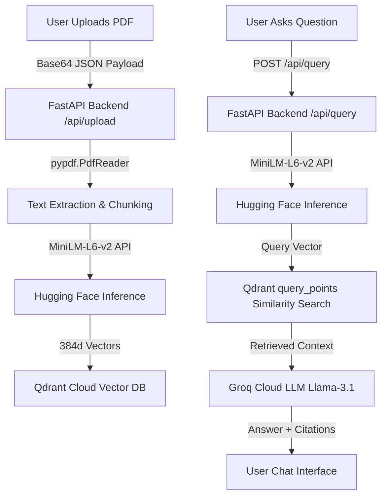

# IndusMind 🛠️ — Industrial RAG Document Q&A System

IndusMind is a premium, high-performance Retrieval-Augmented Generation (RAG) web application designed for engineers, technicians, and operators to interactively query complex industrial manuals, datasheets, and Standard Operating Procedures (SOPs). 

It is engineered as a **full-stack monorepo hosted on Vercel**—bundling a sleek, modern React frontend with a serverless Python FastAPI backend. The vector search is powered by Qdrant Cloud, text embeddings are processed on-demand using Hugging Face Serverless Inference, and Q&A reasoning is generated using Groq Cloud's ultra-fast Llama-3.1-8b LLM.

---

## Key Features

- **Unified PDF Ingestion**: Upload industrial manuals or datasheets directly via the left-side ingestion panel or the chat bar's attachment button.
- **Ultra-Lightweight Serverless Backend**: Built without heavy local ML runtimes (no PyTorch, ONNX, or local sentence-transformers) to comply with Vercel's serverless package size limits (<10MB zipped).
- **Interactive Retrieval-Augmented Q&A**: Uses state-of-the-art similarity search via Qdrant's modern `query_points` API to retrieve contextual chunks, passing them to Groq's Llama 3.1 for high-accuracy answers with direct source citations.
- **Premium Industrial UI**: Designed with a high-fidelity obsidian/zinc monochrome theme, featuring smooth micro-animations, glassmorphic layout elements, and dynamic animated SVG gradient-tracing lines.

---

## Architecture & Data Flow



---

## Tech Stack

| Component | Technology | Description |
| :--- | :--- | :--- |
| **Frontend** | React 18 + Vite | Modern, fast bundler and component UI |
| **Styling** | Tailwind CSS + Lucide Icons | Responsive utility-first design framework |
| **Backend** | FastAPI (Python 3.12) | Asynchronous REST API serverless endpoints |
| **Embeddings** | Hugging Face API | `sentence-transformers/all-MiniLM-L6-v2` |
| **LLM Inference** | Groq Cloud | `llama-3.1-8b-instant` for near-instant responses |
| **Vector DB** | Qdrant Cloud | Remote managed vector database |
| **Deployment** | Vercel | Monorepo deployment (Vite + Python Serverless Functions) |

---

## Getting Started

### Prerequisites
- Node.js (v18+)
- Python (v3.10+)
- Accounts: [Groq Console](https://console.groq.com/), [Qdrant Cloud](https://cloud.qdrant.io/), [Hugging Face](https://huggingface.co/)

---

### Local Development Setup

#### 1. Configure Backend Functions
Navigate to the root directory and set up the Python environment:
```bash
# Create and activate virtual environment
python -m venv .venv
# On Windows PowerShell:
.\.venv\Scripts\Activate.ps1
# On macOS/Linux:
source .venv/bin/activate

# Install dependencies
pip install -r requirements.txt
```

Create a `.env` file in the root directory:
```env
GROQ_API_KEY=gsk_...
QDRANT_URL=https://...aws.cloud.qdrant.io
QDRANT_API_KEY=your_qdrant_api_key
HUGGINGFACE_API_KEY=hf_...
FRONTEND_URL=http://localhost:5173
```

Run the local development backend server:
```bash
python main.py
```
*The backend runs at `http://localhost:8000` with hot-reloading enabled.*

#### 2. Run Frontend Dev Server
Open a new terminal window:
```bash
# Install node packages
npm install

# Run Vite development server
npm run dev
```
*The frontend runs at `http://localhost:5173`. Frontend requests targeting `/api/*` are automatically proxied to `http://localhost:8000` during local development.*

---

## Production Deployment (Vercel)

This project is configured out-of-the-box for zero-config Vercel monorepo deployment via [vercel.json](file:///e:/Projects/RAG%20Industrial%20Document%20Q&A/vercel.json).

### 1. Set Up Environment Variables
Log in to your Vercel Dashboard, navigate to your Project Settings -> **Environment Variables**, and configure:
* `GROQ_API_KEY`: Your Groq Cloud completion API key.
* `QDRANT_URL`: Your Qdrant Cloud cluster endpoint.
* `QDRANT_API_KEY`: Your Qdrant Cloud API authorization token.
* `HUGGINGFACE_API_KEY`: Your Hugging Face serverless Read token.

*Do NOT add `VITE_API_URL` when deploying frontend and backend together on Vercel. Leaving it undefined allows the frontend to default to relative path routing `/api/*` on the same domain, preventing CORS issues.*

### 2. Deploy to Production
Install the Vercel CLI and run:
```bash
npx vercel --prod --force --yes
```

---

## Project Structure

```text
├── api/
│   └── index.py            # Vercel Serverless Function entry point
├── routes/
│   ├── upload.py           # Ingestion router (PDF parsing, embedding generation, Qdrant indexing)
│   └── query.py            # Query router (semantic search context lookup, Groq LLM completion)
├── src/
│   ├── components/
│   │   ├── ChatPanel.jsx   # Interactive chat interface & paperclip upload trigger
│   │   ├── UploadPanel.jsx # Left sidebar upload state with percentage tracker
│   │   └── ui/             # Reusable animated UI elements
│   ├── App.jsx             # Root layout & global states
│   ├── api.js              # Axios-based API client with Base64 payload converters
│   └── index.css           # Global custom classes & resets
├── vercel.json             # Vercel deployment & routing configuration
├── requirements.txt        # Serverless backend python dependencies
└── package.json            # Frontend node scripts & dependencies
```

---

## License
Distributed under the MIT License. See `LICENSE` for more information.
